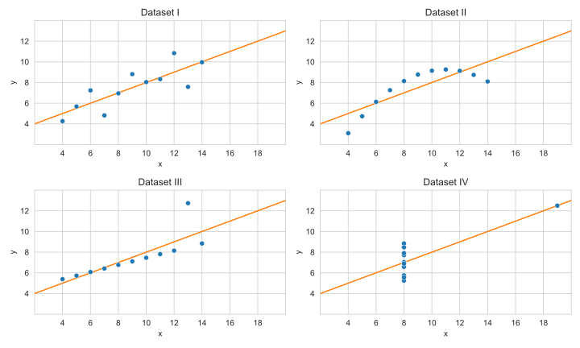

Data visualization is a crucial part of any data analysis.
It enables us to transform complex, multi-modal information into intuitive visual formats that we can quickly understand.
This allows us to easily identify patterns and trends that might be hidden in raw data.
While rigorous statistical analysis is very important for thorough data processing,
sometimes a quick glance at a visualization can be even more revealing.
Let’s explore this concept using a famous example: [Asnsocmbe’s quartet](https://en.wikipedia.org/wiki/Anscombe%27s_quartet).

Anscombe’s quartet consists of four datasets – sets of X-Y values – which are shown below:
<table style="margin: auto; border-collapse: collapse; border: 3px solid; text-align: center; ">
    <thead style="border-bottom: 2px solid">
        <tr>
            <th colspan="2" style="border-right: 2px solid">Dataset I</th>
            <th colspan="2" style="border-right: 2px solid">Dataset II</th>
            <th colspan="2" style="border-right: 2px solid">Dataset III</th>
            <th colspan="2" style="border-right: 2px solid">Dataset IV</th>
        </tr>
        <tr>
            <th>x</th>
            <th style="border-right: 2px solid">y</th>
            <th>x</th>
            <th style="border-right: 2px solid">y</th>
            <th>x</th>
            <th style="border-right: 2px solid">y</th>
            <th>x</th>
            <th>y</th>
        </tr>
    </thead>
    <tbody>
        <tr>
            <td>10.0</td>
            <td style="border-right: 2px solid">8.04</td>
            <td>10.0</td>
            <td style="border-right: 2px solid">9.14</td>
            <td>10.0</td>
            <td style="border-right: 2px solid">7.46</td>
            <td>8.0</td>
            <td>6.58</td>
        </tr>
        <tr>
            <td>8.0</td>
            <td style="border-right: 2px solid">6.95</td>
            <td>8.0</td>
            <td style="border-right: 2px solid">8.14</td>
            <td>8.0</td>
            <td style="border-right: 2px solid">6.77</td>
            <td>8.0</td>
            <td>5.76</td>
        </tr>
        <tr>
            <td>13.0</td>
            <td style="border-right: 2px solid">7.58</td>
            <td>13.0</td>
            <td style="border-right: 2px solid">8.74</td>
            <td>13.0</td>
            <td style="border-right: 2px solid">12.74</td>
            <td>8.0</td>
            <td>7.71</td>
        </tr>
        <tr>
            <td>9.0</td>
            <td style="border-right: 2px solid">8.81</td>
            <td>9.0</td>
            <td style="border-right: 2px solid">8.77</td>
            <td>9.0</td>
            <td style="border-right: 2px solid">7.11</td>
            <td>8.0</td>
            <td>8.84</td>
        </tr>
        <tr>
            <td>11.0</td>
            <td style="border-right: 2px solid">8.33</td>
            <td>11.0</td>
            <td style="border-right: 2px solid">9.26</td>
            <td>11.0</td>
            <td style="border-right: 2px solid">7.81</td>
            <td>8.0</td>
            <td>8.47</td>
        </tr>
        <tr>
            <td>14.0</td>
            <td style="border-right: 2px solid">9.96</td>
            <td>14.0</td>
            <td style="border-right: 2px solid">8.10</td>
            <td>14.0</td>
            <td style="border-right: 2px solid">8.84</td>
            <td>8.0</td>
            <td>7.04</td>
        </tr>
        <tr>
            <td>6.0</td>
            <td style="border-right: 2px solid">7.24</td>
            <td>6.0</td>
            <td style="border-right: 2px solid">6.13</td>
            <td>6.0</td>
            <td style="border-right: 2px solid">6.08</td>
            <td>8.0</td>
            <td>5.25</td>
        </tr>
        <tr>
            <td>4.0</td>
            <td style="border-right: 2px solid">4.26</td>
            <td>4.0</td>
            <td style="border-right: 2px solid">3.10</td>
            <td>4.0</td>
            <td style="border-right: 2px solid">5.39</td>
            <td>19.0</td>
            <td>12.50</td>
        </tr>
        <tr>
            <td>12.0</td>
            <td style="border-right: 2px solid">10.84</td>
            <td>12.0</td>
            <td style="border-right: 2px solid">9.13</td>
            <td>12.0</td>
            <td style="border-right: 2px solid">8.15</td>
            <td>8.0</td>
            <td>5.56</td>
        </tr>
        <tr>
            <td>7.0</td>
            <td style="border-right: 2px solid">4.82</td>
            <td>7.0</td>
            <td style="border-right: 2px solid">7.26</td>
            <td>7.0</td>
            <td style="border-right: 2px solid">6.42</td>
            <td>8.0</td>
            <td>7.91</td>
        </tr>
        <tr>
            <td>5.0</td>
            <td style="border-right: 2px solid">5.68</td>
            <td>5.0</td>
            <td style="border-right: 2px solid">4.74</td>
            <td>5.0</td>
            <td style="border-right: 2px solid">5.73</td>
            <td>8.0</td>
            <td>6.89</td>
        </tr>
    </tbody>
</table>

If you apply basic statistical analysis to this data,
you’ll find that many metrics are identical or nearly identical across the sets: the mean, variance, correlation, regression, etc.
This might lead you to believe that although these datasets are distinct, they are fundamentally very similar.

<table style="margin: auto; border-collapse: collapse; border: 3px solid; text-align: center;">
    <thead style="border-bottom: 2px solid;">
        <tr>
            <th>Property</th>
            <th>Value</th>
        </tr>
    </thead>
    <tbody>
        <tr>
            <td><a href="https://en.wikipedia.org/wiki/Mean">Mean</a> of x</td>
            <td>9</td>
        </tr>
        <tr>
            <td><a href="https://en.wikipedia.org/wiki/Sample_variance">Sample variance</a> of x</td>
            <td>11</td>
        </tr>
        <tr>
            <td>Mean of y</td>
            <td>7.50</td>
        </tr>
        <tr>
            <td>Sample variance of y</td>
            <td>4.125 (±0.003)</td>
        </tr>
        <tr>
            <td><a href="https://en.wikipedia.org/wiki/Correlation">Correlation</a></td>
            <td>0.816</td>
        </tr>
        <tr>
            <td><a href="https://en.wikipedia.org/wiki/Linear_regression">Linear regression line</a></td>
            <td>y = 3.00 + 0.500x</td>
        </tr>
        <tr>
            <td><a href="https://en.wikipedia.org/wiki/Coefficient_of_determination" target="_blank">Coefficient of determination</a></td>
            <td>0.67</td>
        </tr>
    </tbody>
</table>

However, as soon as you visualize them, a completely different picture emerges.
It can be seen that these datasets are, in fact, very different,
and the concept of linear regression does not even apply to all of them.
Take a close look at these plots and observe how unique they are
and how differently you might interpret or analyze each one.
Remarkably, all of this insight comes from just a simple glance at four basic scatter plots.

<figure>
    
    <figcaption style="text-align: center; font-size: 0.6rem">Data by <a href="https://doi.org/10.1080%2F00031305.1973.10478966">F. J. Anscombe</a></figcaption>
</figure>
