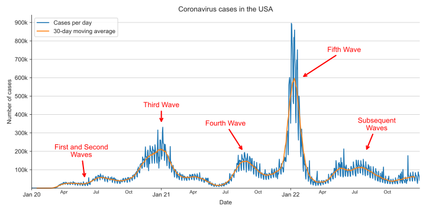

It’s easy to see how essential effective visualization is through numerous examples.
Let’s explore one historical example and one modern one.

The classical example is [Florence Nightingale's](https://en.wikipedia.org/wiki/Florence_Nightingale) Rose Diagram.
Florence Nightingale, a 19th-century statistician and nurse, gained recognition for pioneering modern nursing.
One significant contribution was her creation of the "Diagram of the causes of mortality in the army in the East" –
a detailed and thoughtful visualization depicting the British army's losses in the Crimean war (1854–1856).
By showing the proportion of soldiers dying from epidemic disease versus battle wounds,
she made a case for better sanitation, and the clear data visualization made her argument both direct and effective.

<figure>
    
    <figcaption style="text-align: center; font-size: 0.6rem">Image by <a href="http://resource.nlm.nih.gov/101598842">The United States National Library of Medicine</a> (Public Domain, Modified)</figcaption>
</figure>

For a modern example, consider not just a single chart but an entire category of charts
that became ubiquitous: visualizations of coronavirus cases.
While keeping track of the numbers in the case of a pandemic is crucial,
numbers quickly became overwhelming, especially given their tragic nature.
However, simple and clear visualizations allowed people to see trends, realize the seriousness of the situation, 
and clearly observe the “waves” of the virus as well as the impact of its various variants.

<figure>
    
    <figcaption style="text-align: center; font-size: 0.6rem">Data by <a href="https://data.cdc.gov/Case-Surveillance/COVID-19-Case-Surveillance-Public-Use-Data/vbim-akqf">CDC</a> (Public Domain)</figcaption>
</figure>
