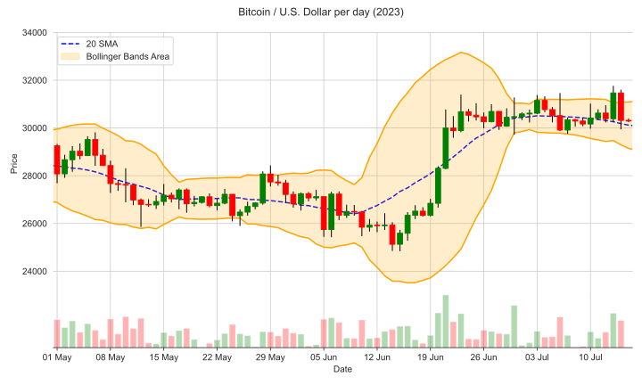
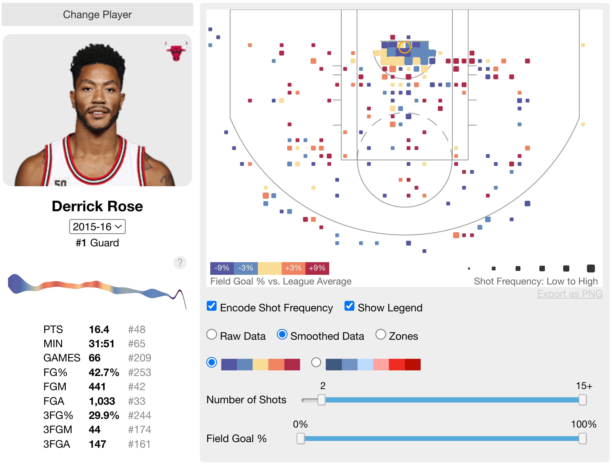
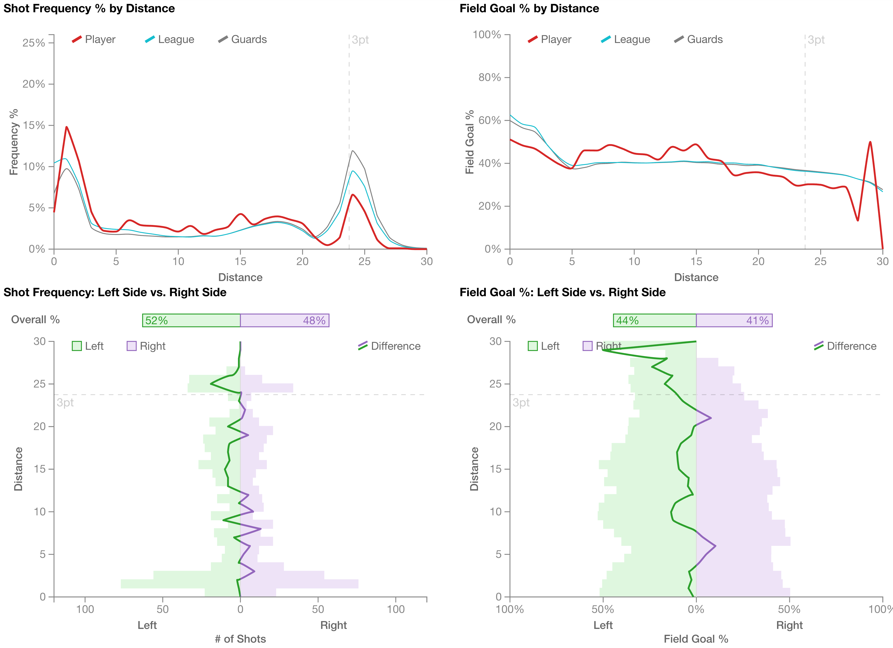
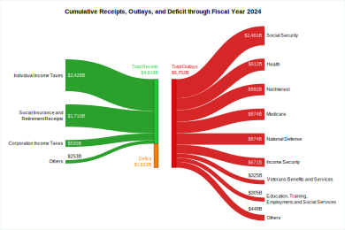

Nowadays, virtually every aspect of our lives relies on some form of visualization.
This includes finance, where exchange rate charts play a crucial role in shaping the modern economy...

<figure>
    
    <figcaption style="text-align: center; font-size: 0.6rem">Data by <a href="https://www.kaggle.com/datasets/shiivvvaam/bitcoin-historical-data">shiivvvaam</a> (Public Domain)</figcaption>
</figure>

...Sports...

<figure>
    
    <figcaption style="text-align: center; font-size: 0.6rem">Visualizations by <a href="https://buckets.peterbeshai.com/app/#/playerView/201565_2015">Peter Beshai</a></figcaption>
    

    
    <figcaption style="text-align: center; font-size: 0.6rem">Visualizations by <a href="https://buckets.peterbeshai.com/app/#/playerView/201565_2015">Peter Beshai</a></figcaption>
</figure>

...And even the government.

<figure>
    
    <figcaption style="text-align: center; font-size: 0.6rem">
        Data by <a href="https://fiscaldata.treasury.gov/datasets/monthly-treasury-statement/summary-of-receipts-outlays-and-the-deficit-surplus-of-the-u-s-government">US Treasury</a> (Public Domain)
    </figcaption>
</figure>

