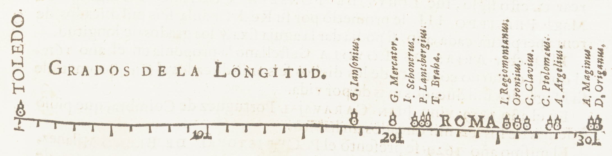

Early visualization didn't emerge in the digital era—it has much deeper roots.
As far back as the 17th century, artists and scientists began crafting hand‐drawn maps 
and simple charts to illustrate geographic and astronomical data. 
These early efforts laid the conceptual groundwork for modern visualization by demonstrating that 
visual representations could convey complex information much more intuitively than raw numbers alone. 
For example, early cartographers created rudimentary maps to depict territories, 
while early scientific diagrams began illustrating relationships between data points.

<figure>
    <figcaption style="text-align: center">A Map of New England, created by <a href="https://en.wikipedia.org/wiki/William_Hubbard_(clergyman)">William Hubbard</a></figcaption>
    
    <figcaption style="text-align: center; font-size: 0.6rem">Image by <a href="https://www.loc.gov/item/gm71002303/">Library of Congress</a> (Public Domain)</figcaption>
</figure>

<figure>
    <figcaption style="text-align: center">A graph of statistical data showing the wide range of estimates for the distance in longitude between Toledo and Rome, created by <a href="https://en.wikipedia.org/wiki/William_Hubbard_(clergyman)">William Hubbard</a></figcaption>
    
    <figcaption style="text-align: center; font-size: 0.6rem">Image by <a href="https://collections.newberry.org/asset-management/2KXJ8ZW843LW?WS=SearchResults">Newberry Library</a> (Public Domain, Modified)</figcaption>
</figure>
