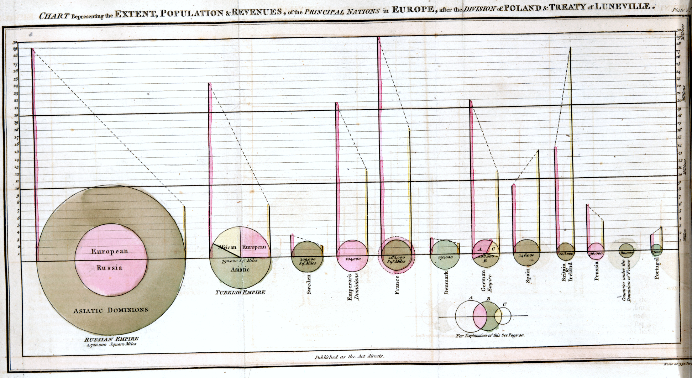

The evolution of data visualization gathered pace in the late 18th century with the invention of statistical graphics.

[William Playfair](https://en.wikipedia.org/wiki/William_Playfair) pioneered many modern chart types 
(including line, bar, area, and pie charts) in his Commercial and Political Atlas (1786). 
His work not only transformed economic reporting 
but also demonstrated that a well‐designed chart could tell a compelling story through data.

<figure>
    
    <figcaption style="text-align: center; font-size: 0.6rem">Image by <a href="https://colenda.library.upenn.edu/catalog/81431-p3bv7bb8v">University of Pennsylvania Libraries</a> (Public Domain, Modified)</figcaption>
</figure>

<figure>
    
    <figcaption style="text-align: center; font-size: 0.6rem">Image by <a href="https://colenda.library.upenn.edu/catalog/81431-p3gh9bs0c">University of Pennsylvania Libraries</a> (Public Domain, Modified)</figcaption>
</figure>

In the 19th century, visualizations became powerful tools for public health and military strategy. 
[John Snow](https://en.wikipedia.org/wiki/John_Snow)'s cholera map (1854) pinpointed the source of a deadly outbreak in London, 
while [Charles Minard](https://en.wikipedia.org/wiki/Charles_Joseph_Minard)'s famous diagram of Napoleon's Russian campaign elegantly combined six variables 
(army size, geography, time, temperature, and direction) to depict a dramatic story of loss and survival.

<figure>
    
    <figcaption style="text-align: center; font-size: 0.6rem">Image by <a href="https://www.ph.ucla.edu/epi/snow/highressnowmap.html">University of California Los Angeles</a> (Public Domain, Modified)</figcaption>
</figure>

<figure>
    
    <figcaption style="text-align: center; font-size: 0.6rem">Image by <a href="https://gallica.bnf.fr/ark:/12148/btv1b52504201x">National Library of France</a> (Public Domain, Modified)</figcaption>
</figure>
