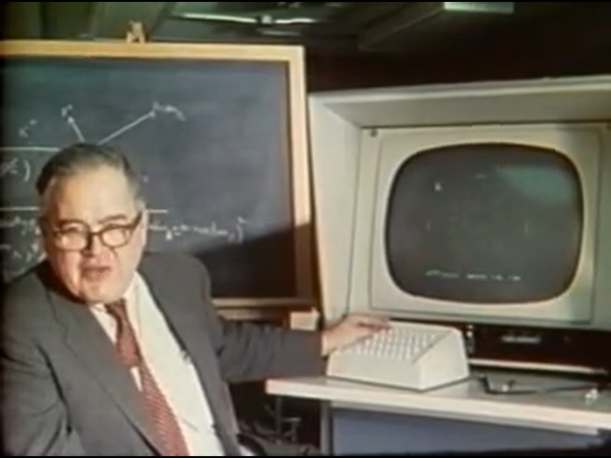

The advent of computer graphics in the 20th century revolutionized data visualization.

Paper-based charts gave way to dynamic, digital displays, 
enabling visualizations to become interactive and adaptive—features impossible with static paper charts.
This digital transformation made it feasible to update visualizations in real time, 
embed interactivity, and handle far more complex data structures.

In the 1960s, <a href="https://en.wikipedia.org/wiki/John_Tukey">John Tukey</a>'s work on exploratory data analysis (EDA) 
formalized many visualization techniques we now take for granted—such 
as stem‐and‐leaf plots, box plots, and scatter plots. While Tukey’s methods didn’t “invent” digital visualization, 
they helped advance the concept that computers could be used not just to crunch numbers but also to reveal patterns visually.

<figure>
    <figcaption style="text-align: center">John Tukey presenting PRIM-9, one of the first computer-assisted data visualization systems</figcaption>
    
    <figcaption style="text-align: center; font-size: 0.6rem">Still from <a href="https://www.youtube.com/watch?v=B7XoW2qiFUA">a demonstration video</a> by the <a href="https://community.amstat.org/jointscsg-section/media/videos">ASA Statistical Graphics Video Library</a></figcaption>
</figure>

<figure>
    <figcaption style="text-align: center">Animation showing the rotation of 4-dimensional physics data</figcaption>
    
    <figcaption style="text-align: center; font-size: 0.6rem">Animation from <a href="https://www.youtube.com/watch?v=B7XoW2qiFUA">a demonstration video</a> by the <a href="https://community.amstat.org/jointscsg-section/media/videos">ASA Statistical Graphics Video Library</a></figcaption>
</figure>
