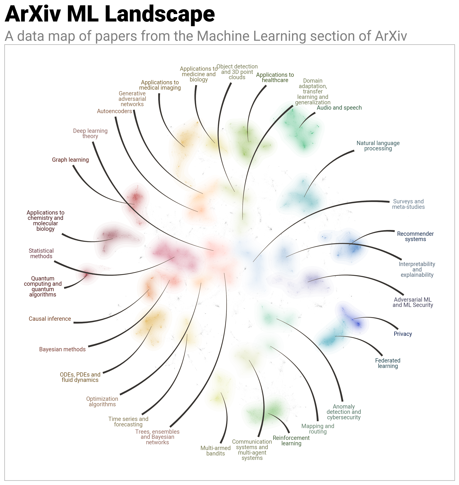

Modern computing power has transformed visualization from a static art form into an interactive exploration tool.

Real-time processing of massive datasets 
now enables dynamic visualizations that can adapt and respond to user input.
As a result, visualizations have evolved from being mere illustrations 
to becoming active environments where analysts can zoom, filter, and dive deep into data insights on demand. 
This shift marks a significant transition from simple presentation to interactive exploration.

<figure>
    
    <figcaption style="text-align: center; font-size: 0.6rem"><a href="https://github.com/TutteInstitute/datamapplot/blob/67bc608d8a608459ed4b94a8eef7c998a6a6eda2/examples/arxiv_ml_data_map.npy">Data</a> and <a href="https://github.com/TutteInstitute/datamapplot/blob/67bc608d8a608459ed4b94a8eef7c998a6a6eda2/examples/plot_arxiv_ml.py">code</a> by <a href="https://github.com/TutteInstitute/datamapplot">DataMapPlot</a> (Tutte Institute for Mathematics and Computing, <a href="https://github.com/TutteInstitute/datamapplot/blob/67bc608d8a608459ed4b94a8eef7c998a6a6eda2/LICENSE">MIT License</a>)</figcaption>
</figure>
