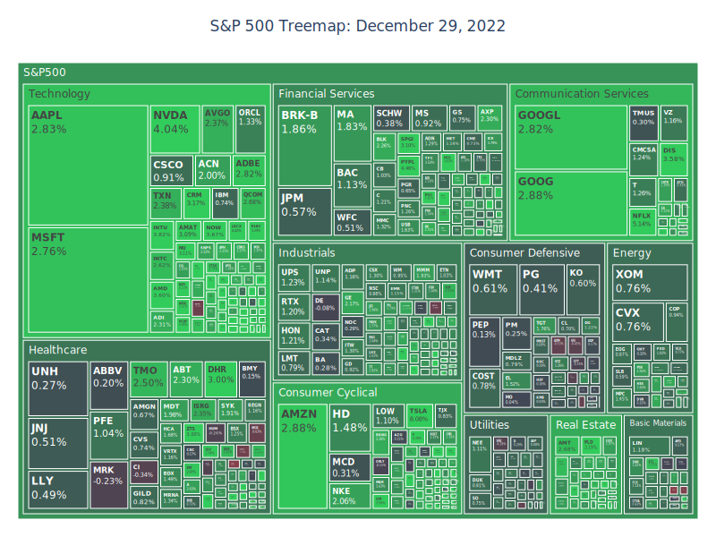

En el mundo actual, el enorme volumen de datos que se genera hace que la visualización sea más crucial que nunca.  
La visualización no solo nos ayuda a identificar tendencias y patrones que podrían ser difíciles de detectar en datos en bruto,  
sino que también aborda el desafío de la sobrecarga de datos: simplemente hay demasiados datos en bruto para comprenderlos todos.  
Visualizar este abrumador volumen de información es, a menudo, la única forma de extraer conocimientos significativos.  

<figure>  
      
    <figcaption style="text-align: center; font-size: 0.6rem">  
        Datos de <a href="https://www.kaggle.com/datasets/yash16jr/s-and-p-500-all-assets">yash16jr</a> (Dominio Público)  
        y <a href="https://www.kaggle.com/datasets/andrewmvd/sp-500-stocks">andrewmvd</a> (Dominio Público)  
    </figcaption>  
</figure>