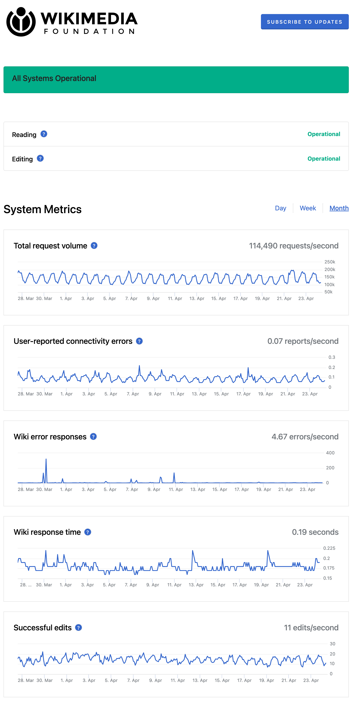

No solo es necesario analizar rápidamente estos datos,  
sino que, en ocasiones, deben tomarse medidas drásticas o decisiones basadas en ellos; y, en tales casos, la visualización se vuelve crucial.  
Visualizaciones claras y precisas permiten que las partes interesadas  
comprendan situaciones complejas y tomen decisiones informadas de manera ágil.  
El ejemplo anterior de un mapa de calor del mercado de valores es una ilustración excelente, pero incluso en escenarios más cotidianos,  
los paneles de control son esenciales para monitorear el estado y la disponibilidad de aplicaciones y sitios web.

<figure style="display: block; margin-left: auto; margin-right: auto; width: 70%;">
    
    <figcaption style="text-align: center; font-size: 0.6rem">
        <a href="https://www.wikimediastatus.net/#month">Estado mensual</a> de los servicios de la <a href="https://wikimediafoundation.org/">Fundación Wikimedia</a>
    </figcaption>
</figure>