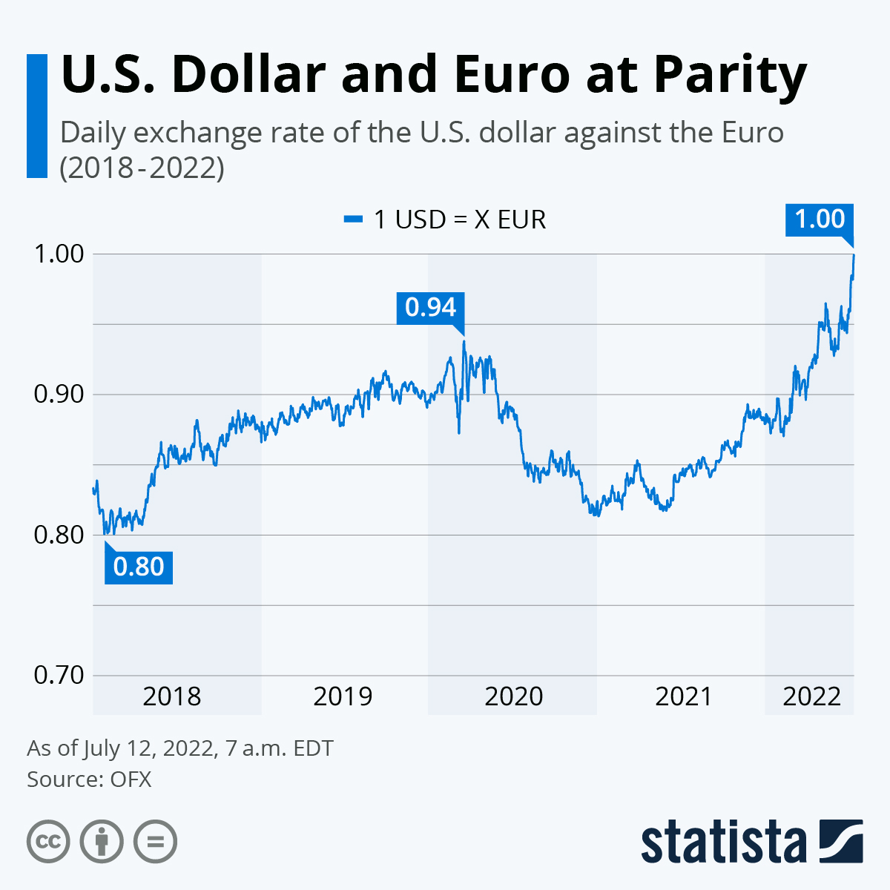
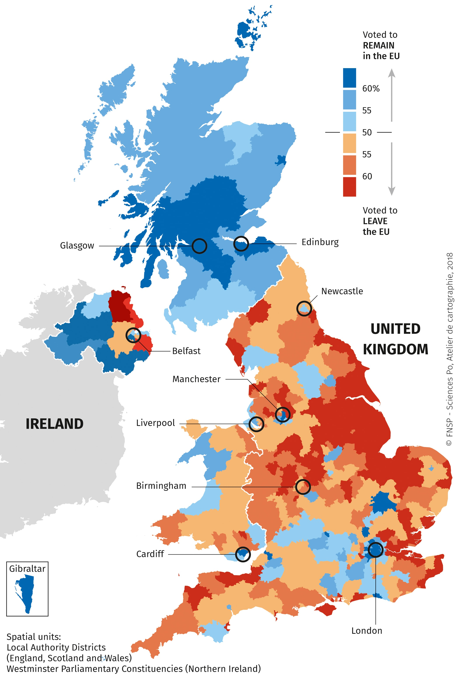

Igualmente importante, el desafío no es solo el volumen de datos, sino también su accesibilidad.  
Hoy en día, las personas tienen más acceso a los datos que nunca antes en la historia.  
Esto significa que los datos deben ser comprensibles no solo para las partes interesadas profesionales,  
sino también para usuarios no técnicos. Tomemos como ejemplo el mercado de valores:  
si bien puede ser necesario visualizarlo con detalle para directores generales y grandes bancos,  
las visualizaciones más simples y directas suelen ser requeridas por individuos que gestionan inversiones moderadas.

<figure>
    
    <figcaption style="text-align: center; font-size: 0.6rem">
        Visualización realizada por <a href="https://www.statista.com/chart/10904/usd-eur-echange-rate/">statista</a> (<a href="https://creativecommons.org/licenses/by-nd/3.0/">CC BY-ND 3.0</a>)
    </figcaption>
</figure>

De manera similar, la visualización de datos mejora las campañas políticas al presentar los problemas a los votantes con mayor claridad que nunca.

<figure>
    
    <figcaption style="text-align: center; font-size: 0.6rem">
        Visualización realizada por <a href="https://espace-mondial-atlas.sciencespo.fr/en/topic-strategies-of-transnational-actors/map-3C55-EN-referendum-on-the-uk-s-membership-of-the-european-union-june-23-2016.html">SciencePo</a>
    </figcaption>
</figure>