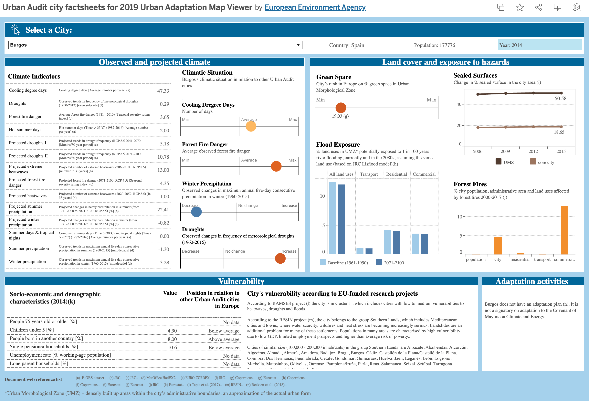

La explosión de los big data ha creado un mercado laboral completamente nuevo centrado en la visualización y el análisis de datos.  
Los analistas de datos y los especialistas en visualización se han vuelto esenciales en prácticamente todas las industrias, desde la atención médica hasta las finanzas.  
Estos profesionales combinan experiencia técnica en la manipulación de datos con habilidades creativas para presentar información compleja de manera accesible.  
El campo continúa evolucionando con la aparición de herramientas especializadas como Tableau y Power BI, junto con una demanda creciente de dominio en análisis estadístico y narración de datos.  
Esta confluencia de habilidades técnicas y creativas ha convertido a los especialistas en visualización de datos en algunos de los profesionales más buscados en el mercado laboral actual, ofreciendo salarios competitivos y ampliando las oportunidades de carrera tanto en industrias tradicionales como emergentes.  

<figure>
    
    <figcaption style="text-align: center; font-size: 0.6rem">
        Dashboard de <a href="https://public.tableau.com/app/profile/european.environment.agency/viz/test_20190116Urban_vulnerability_ideasFR_0/mainpage">Tableau Public</a> por <a href="https://www.eea.europa.eu/en">European Environment Agency</a>
    </figcaption>
</figure>