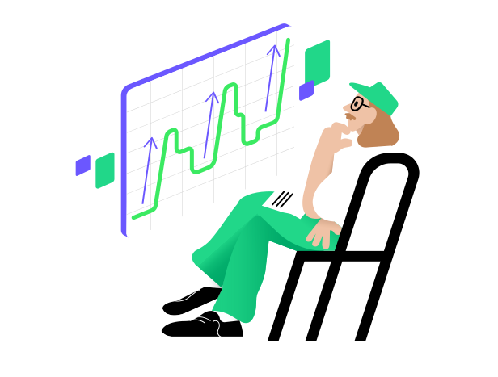

# Análisis de tendencias

Si estás interesado en examinar tendencias, un gráfico de líneas generalmente es más efectivo.  
Muestra los datos con una línea conectada, lo que facilita identificar patrones a largo plazo y cambios a lo largo del tiempo.  
Si tienes un conjunto de datos con una dimensión temporal, un gráfico de líneas permite una representación cronológica de los datos.

Un día, Jonsi intentó predecir el precio de “Success” LLC para decidir si invertir parte de su dinero en ella.  
Trazó un gráfico del precio de las acciones de la empresa y vio que cada caída en el precio de las acciones era seguida por un aumento.  
Jonsi concluyó que el precio de las acciones de la empresa continuaría subiendo, por lo que compró acciones.  
¡Funcionó!  
Después de un mes, el precio de la empresa subió drásticamente, y Jonsi obtuvo una ganancia significativa.  

