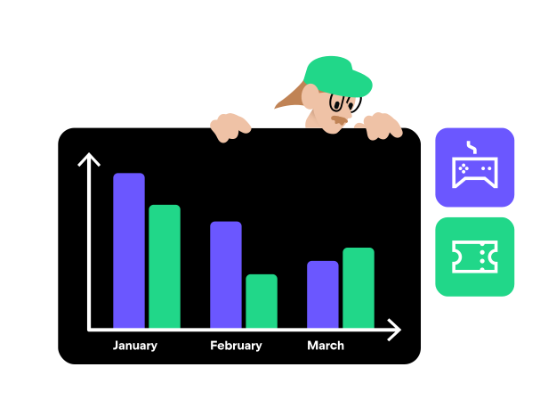

# Change over time

While line charts are typically used to visualize data changes over time,
bar charts can also be employed if the time intervals are discrete and limited.
In such cases, you can use grouped bar charts to show changes across different categories at specific time points.

As part of his plan to save for a vacation, Jonsi finally decided to cut back on his entertainment expenses.
He stopped buying numerous games during sales and chose to focus on the ones he already owned.
He also unsubscribed from streaming services he rarely used.
After three months, Jonsi created a bar chart to track his spending in these two categories.
The chart revealed that he had successfully reduced his expenses, bringing him closer to his savings goal.

