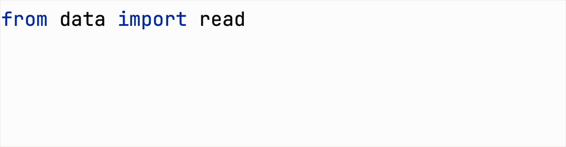

## Teoría

Esto es un poco mejor, pero todavía no es conveniente para explorar.  
Para comprender más fácilmente qué plataformas son más populares, podemos reordenarlas.

El orden de las categorías se controla con el argumento `order`.  
Este acepta una lista de nombres de categorías que especifica el orden de visualización deseado.

## Tarea

Usa la función oculta `get_sorted_platforms`  
para obtener la lista de plataformas en orden ascendente y pásala a la función `catplot`.

Si lo prefieres, puedes ordenar las plataformas manualmente. Por favor, consulta la pista correspondiente a continuación.

## Pistas

   

    Para importarla, puedes colocar el cursor sobre el nombre subrayado de la función oculta en tu código, luego presionar &shortcut:ShowIntentionActions;, y  
    seleccionar <samp>Import 'function_name from data'</samp>:  
    

    Para ordenar las plataformas, puedes usar  
    el método <a href="https://pandas.pydata.org/docs/reference/api/pandas.Series.value_counts.html"><code>value_counts</code></a>  
    en la columna <code>platform</code>:  
    <ol>
        <li>Pasa el argumento <code>sort</code>, junto con <code>ascending</code>.</li>
        <li>Luego, utiliza la propiedad <a href="https://pandas.pydata.org/docs/reference/api/pandas.Series.index.html"><code>index</code></a> para obtener los nombres de las plataformas ordenados.</li>
        <li>Finalmente, convierte el objeto <code>Index</code> a una lista usando el método <a href="https://pandas.pydata.org/docs/reference/api/pandas.Index.to_list.html"><code>to_list</code></a>.</li>
    </ol>

