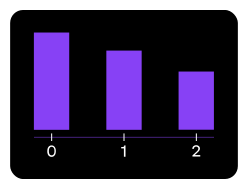

## Theory

So far, we have only built simple bar charts, but sometimes it is necessary to plot several traces on the same chart.
For example, we may want to compare total sales over decades for different regions.

The `bar` method allows you to manually place bars where needed.
For example, if we pass `range(3)` as the x-axis and `[5, 4, 3]` as the heights, the result would look something like this:

As we can see, `bar` placed the first bar at 0, the second at 1, and the third at 2.

For our figure, we will have several groups (decades), and for each group, we will plot several traces (regions).
Let's start with a simple task!

## Task

1. Use the hidden `aggregate` function to calculate the total sales (`sales`) over decades (`decade`) for each region (`region`).
   
   If you prefer, you can do it manually. Please refer to the corresponding hints below.

2. Implement the `plot_region` function. It should plot total regional sales over decades, like in the example.

   You can use the hidden `get_number_of_decades` function for calculating the total number of decades 
   and the `get_region_sales` function to retrieve sales data for a specified region.

   If you prefer, you can do it manually. Please refer to the corresponding hints below.

   Please note that you don't need to use the `trace` argument for now.

3. Use the `plot_region` function to plot the total sales for the North America (`na`) region.

## Hints

   To calculate total sales per decade for each region:
   <ol>
      <li>Use the <a href="https://pandas.pydata.org/docs/reference/api/pandas.cut.html"><code>cut</code></a> function to convert the year of release into decades.</li>
      <li>Use the <a href="https://pandas.pydata.org/docs/reference/api/pandas.melt.html"><code>melt</code></a> function to extract sales regions.</li>
      <li>Group the data by the decade and region columns using the <a href="https://pandas.pydata.org/docs/reference/api/pandas.DataFrame.groupby.html"><code>groupby</code></a> method,
      and calculate total sales using the <a href="https://pandas.pydata.org/docs/reference/api/pandas.core.groupby.DataFrameGroupBy.sum.html"><code>sum</code></a> method.</li>
   </ol>

   Note that your custom function will not be tested.

   To calculate the number of decades, you can use the <a href="https://pandas.pydata.org/docs/reference/api/pandas.DataFrame.nunique.html"><code>nunique</code></a> method on the <code>decade</code> column.

   Note that your custom function will not be tested.

   To filter sales for a specific region, use <a href="https://pandas.pydata.org/pandas-docs/version/1.0/getting_started/intro_tutorials/03_subset_data.html#how-do-i-filter-specific-rows-from-a-dataframe">bracket notation</a> along with a condition on the <code>region</code> column.

   Note that your custom function will not be tested.

   

