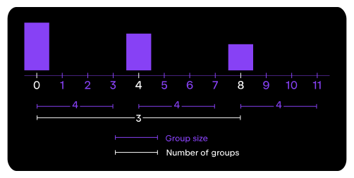
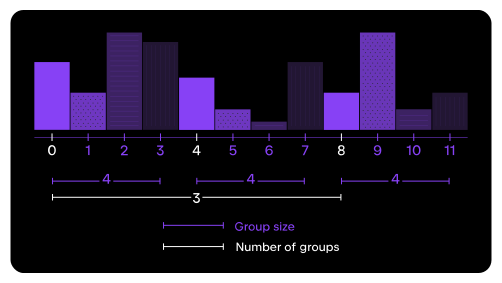
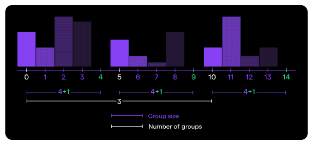

## Theory

As we can see, something has definitely changed on our figure: we plotted several traces, but we can see only some of them.
This happened because we plotted them on the same x-axis coordinates, causing them to overlap.

To fix this, we need to increase the distance between decades to fit each region.

For example, if we have 3 groups, each of size 4,
we would need a distance of 4 to fit the data for all regions:

However, if we do this, there will be no space between the groups:

To fix this, we should artificially increase the size of each group by 1 unit:

As a result, the total distance will be 5.

Also, an important thing to note is that the width of each bar should be equal to 1 so that there is no space between the
bars.
To achieve this, we can use the `width` argument.

## Task

Modify the `plot_region` function to plot each region's data with the correct spacing and use the `trace` argument to
offset each region's trace.

You can use the hidden `get_number_of_regions` function to calculate the number of regions.
If you prefer, you can get all regions manually. Please refer to the corresponding hints below.

## Hints

   To calculate the number of regions, you can use the <a href="https://pandas.pydata.org/docs/reference/api/pandas.DataFrame.nunique.html"><code>nunique</code></a> method on the <code>region</code> column.

   

