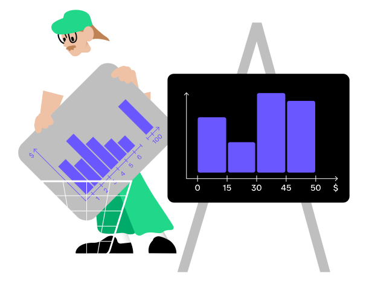

While bar charts are best for comparing values across discrete or categorical variables, 
histograms are designed to represent continuous data.
In a bar chart, each bar corresponds to a distinct category, often separated by gaps to emphasize their discrete nature.
By contrast, histogram bins typically touch, reflecting that the data values lie on a continuous scale.
This visual distinction indicates you’re examining ranges rather than separate categories.

After his promotion, Jonsi was assigned to analyze customer spending at a local café. 
At first, he tried a bar chart, but it quickly became cluttered with individual purchase amounts. 
Realizing his mistake, he switched to a histogram, grouping spending into price ranges. 
This revealed clear patterns in customer behavior — spending tended to cluster around specific price points. 
These insights highlighted popular item combinations and helped the café adjust its menu and pricing strategy more effectively.

