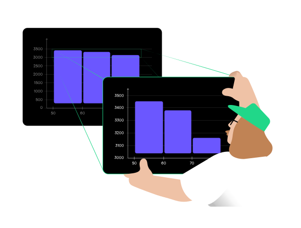

A common mistake when creating histograms is truncating the Y-axis
by starting it above zero or altering its scale in other ways.
This can result in misleading interpretations, as even minor differences between bins may appear exaggerated.

One day, the company where Jonsi works was approached by a chain of croissant stores. 
They wanted to analyze their typical daily croissant sales to optimize costs. 
However, one of Jonsi's colleagues made a mistake: when building the histogram,
they incorrectly set the Y-axis to start above zero, unintentionally exaggerating minor differences between bins.
This made small variations in croissant sales appear large and significant. 
Jonsi noticed the issue, corrected the Y-axis scale,
and demonstrated that the sales data actually showed no substantial differences.
His adjustment helped the company avoid unnecessary business decisions.

