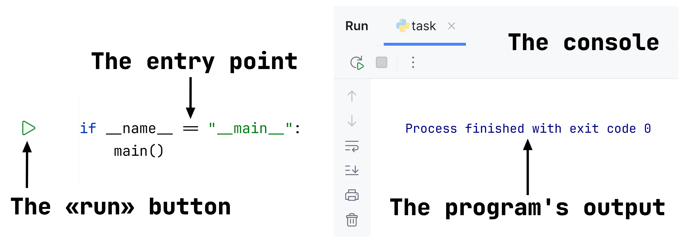

## Goal

The main goal of this lesson is to **explore the distribution of video game sales using histograms**. We will analyze:

1. The overall distribution of global sales
2. The distribution of global sales by publisher

## Theory

In Seaborn, distributions can be visualized using the [
`displot`](https://seaborn.pydata.org/generated/seaborn.displot.html) function. Similar to 
[`catplot`](https://seaborn.pydata.org/generated/seaborn.catplot.html), it accepts a special
argument, `kind`, which defines the type of distribution to be built. By default, `kind="hist"`, and the function creates
a histogram, which we will focus on in this module.

Like other Seaborn functions, `displot` accepts three main arguments: `data`, `x`, and `y`.
We described them in detail in the
"[Line and Scatter Plots](course://1_1_line_and_scatter_plots_seaborn/1_theory/1_relplot_scatter)" section.

## Task

Create a histogram showing the distribution of global sales using the `displot` function. Pass `games` as
`data` and `global_sales` as the x-axis.

Note that we have preprocessed the data for you. To learn how this was done, please see the corresponding hint below.

## Hints

   To run the code, click the green triangle next to the entry point.
   In the case of execution errors, the issues will be displayed in the console inside the IDE. 
   

   After running the code, the graph will be generated next to the `task.py` file.
   

Before using the data, we need to perform several preprocessing steps:
   <ol>
      <li>Convert column names to lowercase.</li>
      <li>Remove games with undecided user scores (where the user score is equal to <code>tbd</code>).</li>
      <li>Drop all NaN values from the following columns:</li>
      <ul>
         <li><code>platform</code></li>
         <li><code>critic_score</code></li>
         <li><code>user_score</code></li>
         <li><code>global_sales</code></li>
         <li><code>eu_sales</code></li>
         <li><code>jp_sales</code></li>
         <li><code>na_sales</code></li>
         <li><code>other_sales</code></li>
      </ul>
      <li>Convert the <code>user_score</code> column to a float.</li>
   </ol>

   

